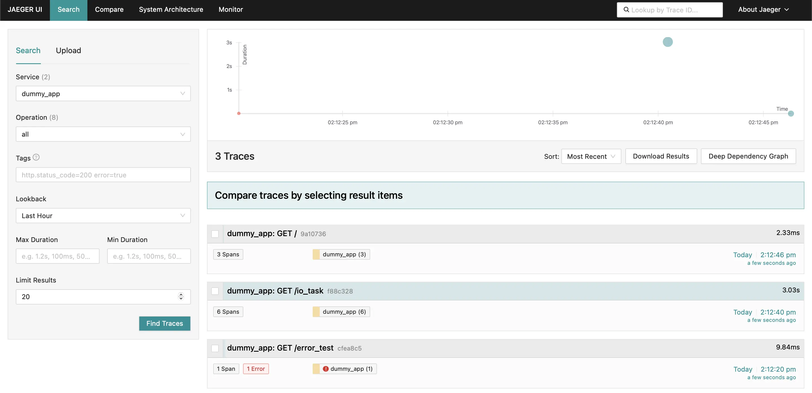
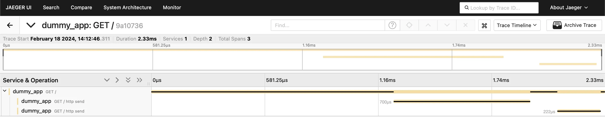
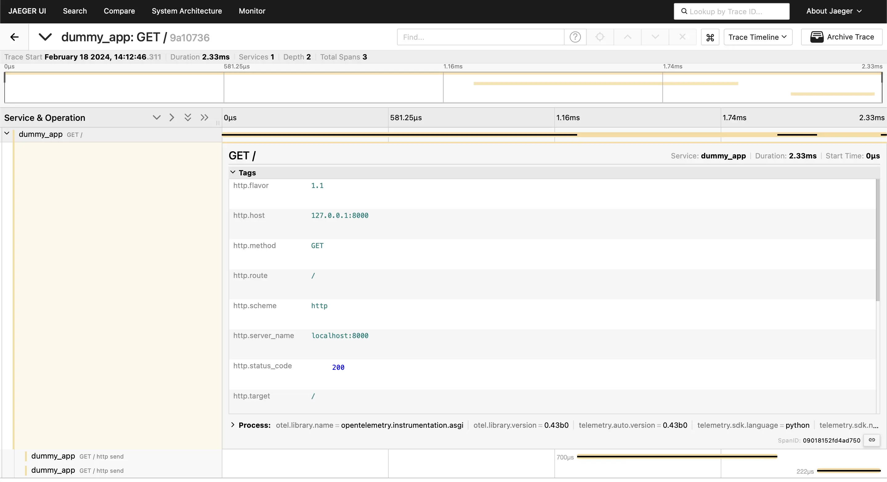
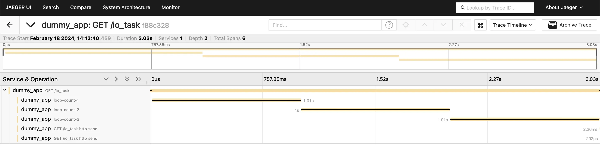
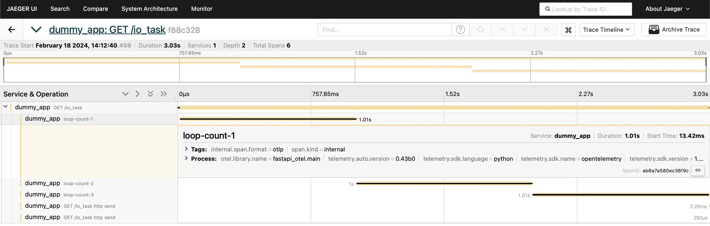
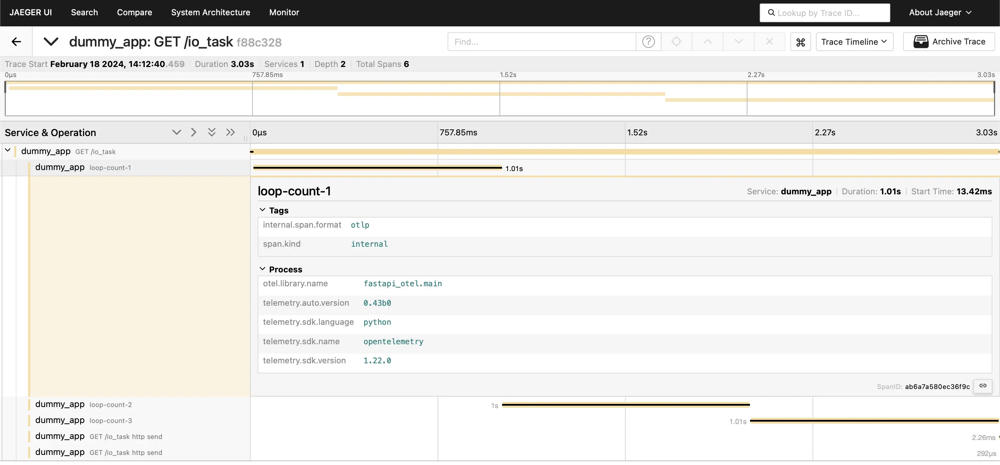
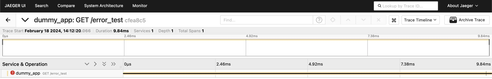
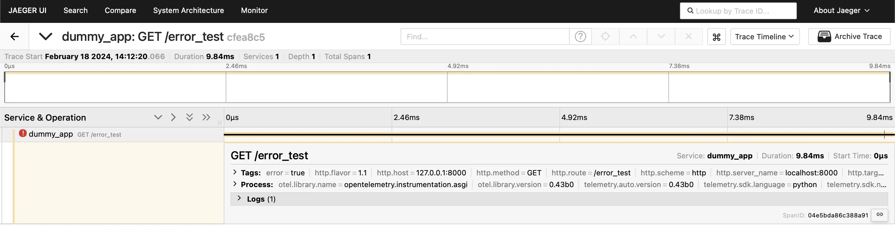
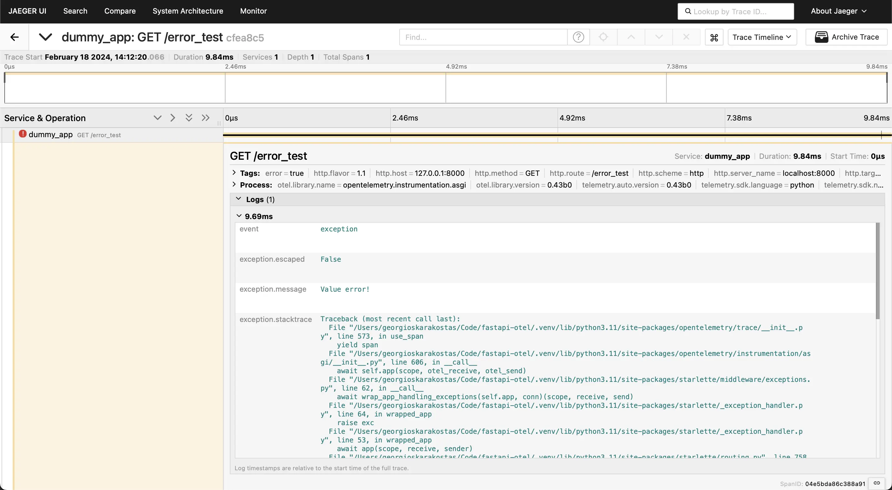

# fastapi-otel

Instrumented FastAPI application using OpenTelemetry and Jaeger.

## Quick Start

1. Install the required project dependencies: `make venv`

2. Start the Jaeger backend service:
    ```bash
    docker run -d --name jaeger \
      -e COLLECTOR_ZIPKIN_HOST_PORT=:9411 \
      -p 6831:6831/udp \
      -p 6832:6832/udp \
      -p 5778:5778 \
      -p 16686:16686 \
      -p 4317:4317 \
      -p 4318:4318 \
      -p 14250:14250 \
      -p 14268:14268 \
      -p 14269:14269 \
      -p 9411:9411 \
      jaegertracing/all-in-one:1.54
    ```

3. Start the instrumented FastAPI service: 
    ```bash
    opentelemetry-instrument --service_name dummy_app uvicorn fastapi_otel.main:app
    ```

4. Send requests to the FastAPI application: http://localhost:8000/docs

5. Check the traces from the Jaeger UI: http://localhost:16686

## Jaeger UI screenshots

Homepage:



Root trace:





I/O task trace:







Error test trace:








